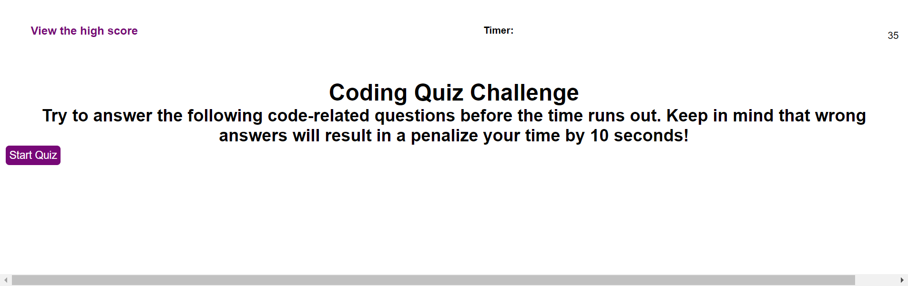

# Coding Quiz
Coding Quiz is a timed quiz with multiple choice questions meant to test JavaScript fundamentals. Wrong answers result in a time penalty.

## Files and Directories
There is a gitignore file. The js, css, and images folders live in the assets directory.

## Publishing
The website is published using github pages.

## Link to application
[Click here to visit the Coding Quiz](hhttps://mymy-4242.github.io/coding-quiz-challenge4/)